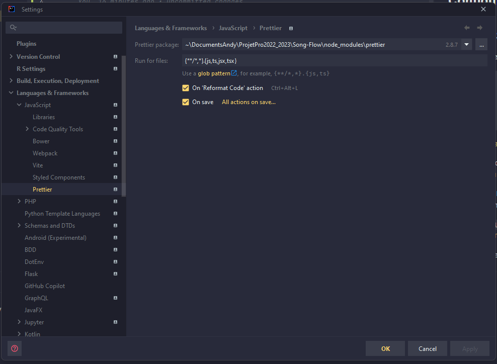
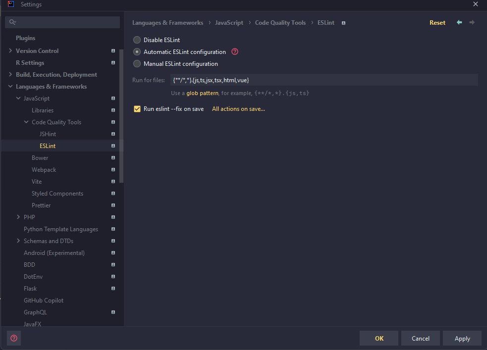

This is a [Next.js](https://nextjs.org/) project bootstrapped with [`create-next-app`](https://github.com/vercel/next.js/tree/canary/packages/create-next-app).

## Configure IDE

Settings > Languages & Frameworks > JavaScript > Prettier > Prettier package > node_modules/prettier

Settings > Languages & Frameworks > JavaScript > Code Quality Tools > ESLint > Automatic ESLint configuration > Enable


---

## Getting Started

First, run the development server:

```bash
npm run dev
# or
yarn dev
# or
pnpm dev
```

Open [http://localhost:3000](http://localhost:3000) with your browser to see the result.
